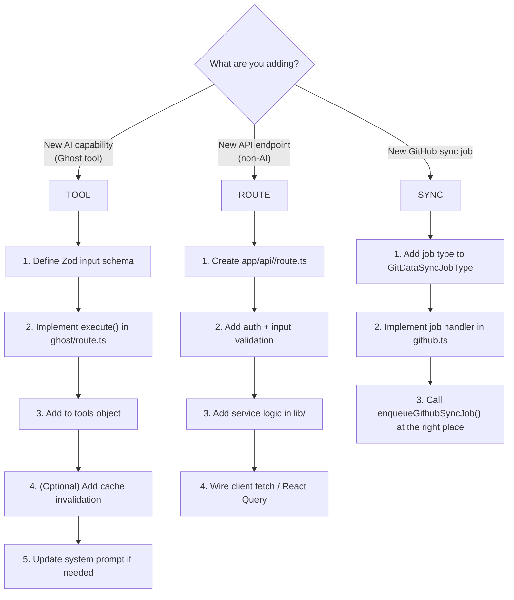

# Adding New Tooling

This guide walks through adding a new integration to Better Hub — either a new **Ghost AI tool** (the most common extension point) or a new **API route with service logic**.

---

## Overview



---

## Example: Adding a "Get Repository Teams" Ghost Tool

The following example adds a tool that lets Ghost look up which GitHub teams have access to a repository. This is a realistic addition that surfaces permissions data the user might ask about.

### Step 1 — Understand the GitHub API

Check the [GitHub REST docs](https://docs.github.com/en/rest/teams/teams#list-teams-for-a-repository):

```
GET /repos/{owner}/{repo}/teams
```

Returns an array of teams with `name`, `slug`, `permission`, and `description`.

### Step 2 — Add the Tool in `ghost/route.ts`

Open `apps/web/src/app/api/ai/ghost/route.ts` and locate the `tools` object passed to `streamText`. Add a new entry:

```typescript
// Inside the tools object:

getRepoTeams: tool({
    description:
        "List the GitHub teams that have access to a repository, along with their permission level (pull, push, admin, maintain, triage).",
    inputSchema: z.object({
        owner: z.string().describe("Repository owner (user or org)"),
        repo:  z.string().describe("Repository name"),
    }),
    execute: async ({ owner, repo }) => {
        const { data } = await octokit.request(
            "GET /repos/{owner}/{repo}/teams",
            { owner, repo },
        );
        return data.map((team) => ({
            name:        team.name,
            slug:        team.slug,
            permission:  team.permission,
            description: team.description,
        }));
    },
}),
```

The tool is automatically wrapped by `withSafeTools()` — errors from the GitHub API (e.g. 404, 403) are caught and returned as `{ error: "…" }` to the LLM so the stream does not crash.

### Step 3 — Verify the Zod Schema

The `inputSchema` is validated before `execute` is called. Use Zod's `.describe()` on every field — the description is included in the schema sent to the LLM, which improves tool-call accuracy.

```typescript
inputSchema: z.object({
    owner: z.string().describe("Repository owner"),
    repo:  z.string().describe("Repository name"),
    // Add optional fields with defaults where sensible:
    per_page: z.number().min(1).max(100).default(30).optional()
        .describe("Number of teams to return (max 100)"),
}),
```

### Step 4 — (Optional) Add to Context Auto-Complete

If the tool is relevant to the current page context, mention it in the system prompt so Ghost knows to use it proactively. Look for the section that builds the system prompt string in `route.ts` and add a hint:

```typescript
// In the system-prompt builder:
if (context?.type === "repo") {
    systemPrompt += `\n- Use getRepoTeams to answer questions about who has access to this repository.`;
}
```

### Step 5 — Test

1. Open Better Hub locally (`bun dev`).
2. Navigate to a repository page.
3. Open Ghost (`⌘I`) and ask: _"Which teams have access to this repo?"_
4. Ghost should call `getRepoTeams` and return a formatted list.

---

## Example: Adding a New API Route

Below is a minimal example of a new route that returns whether a user has write access to a repo. It follows the established patterns in the codebase.

### File: `apps/web/src/app/api/repo-access/route.ts`

```typescript
import { NextRequest, NextResponse } from "next/server";
import { getServerSession } from "@/lib/auth";
import { headers } from "next/headers";
import { getOctokit } from "@/lib/github";

export async function GET(request: NextRequest) {
    const session = await getServerSession(await headers());
    if (!session) {
        return NextResponse.json({ error: "Unauthorized" }, { status: 401 });
    }

    const { searchParams } = new URL(request.url);
    const owner = searchParams.get("owner");
    const repo  = searchParams.get("repo");

    if (!owner || !repo) {
        return NextResponse.json(
            { error: "owner and repo are required" },
            { status: 400 },
        );
    }

    const octokit = getOctokit(session.token);
    const { data } = await octokit.repos.get({ owner, repo });

    return NextResponse.json({
        canPush:  data.permissions?.push  ?? false,
        canAdmin: data.permissions?.admin ?? false,
    });
}
```

**Key conventions:**
- Always call `getServerSession(await headers())` first.
- Return `401` for unauthenticated, `400` for bad input, `403` for permission failures.
- Keep business logic in `lib/` if it will be reused.

---

## Example: Adding a New GitHub Sync Job

If you need periodic or background refreshes of a new GitHub resource type, add a sync job.

### Step 1 — Add the Job Type

In `apps/web/src/lib/github.ts`, find the `GitDataSyncJobType` union and add your new type:

```typescript
type GitDataSyncJobType =
    | "user_repos"
    | /* …existing types… */
    | "repo_teams"        // ← add this
    ;
```

### Step 2 — Implement the Job Handler

In the `executeGithubSyncJob` function (or equivalent handler), add a case:

```typescript
case "repo_teams": {
    const { owner, repo } = payload as { owner: string; repo: string };
    const { data } = await octokit.repos.listTeams({ owner, repo });
    await upsertGithubCacheEntry({
        userId,
        cacheKey:  `repo_teams:${owner}/${repo}`,
        cacheType: "repo_teams",
        dataJson:  JSON.stringify(data),
        etag:      response.headers.etag,
    });
    break;
}
```

### Step 3 — Enqueue the Job

Call `enqueueGithubSyncJob` from the relevant page or API route:

```typescript
await enqueueGithubSyncJob({
    userId,
    jobType:    "repo_teams",
    dedupeKey:  `repo_teams:${owner}/${repo}`,
    payloadJson: JSON.stringify({ owner, repo }),
});
```

---

## Checklist for Any New Integration

- [ ] Input validated with Zod (or equivalent) — never trust client input
- [ ] Auth check (`getServerSession`) before any data access
- [ ] GitHub calls use the user's Octokit instance (not a shared token) for permission enforcement
- [ ] Errors handled gracefully — return structured JSON errors, not raw throws
- [ ] Cache entries invalidated if your integration modifies data
- [ ] Token usage logged if calling an LLM (`logTokenUsage`)
- [ ] Spending limit checked before LLM calls (`checkUsageLimit`)
- [ ] New environment variables documented in `apps/web/.env.example`
- [ ] `bun check` passes (lint + format + types)
