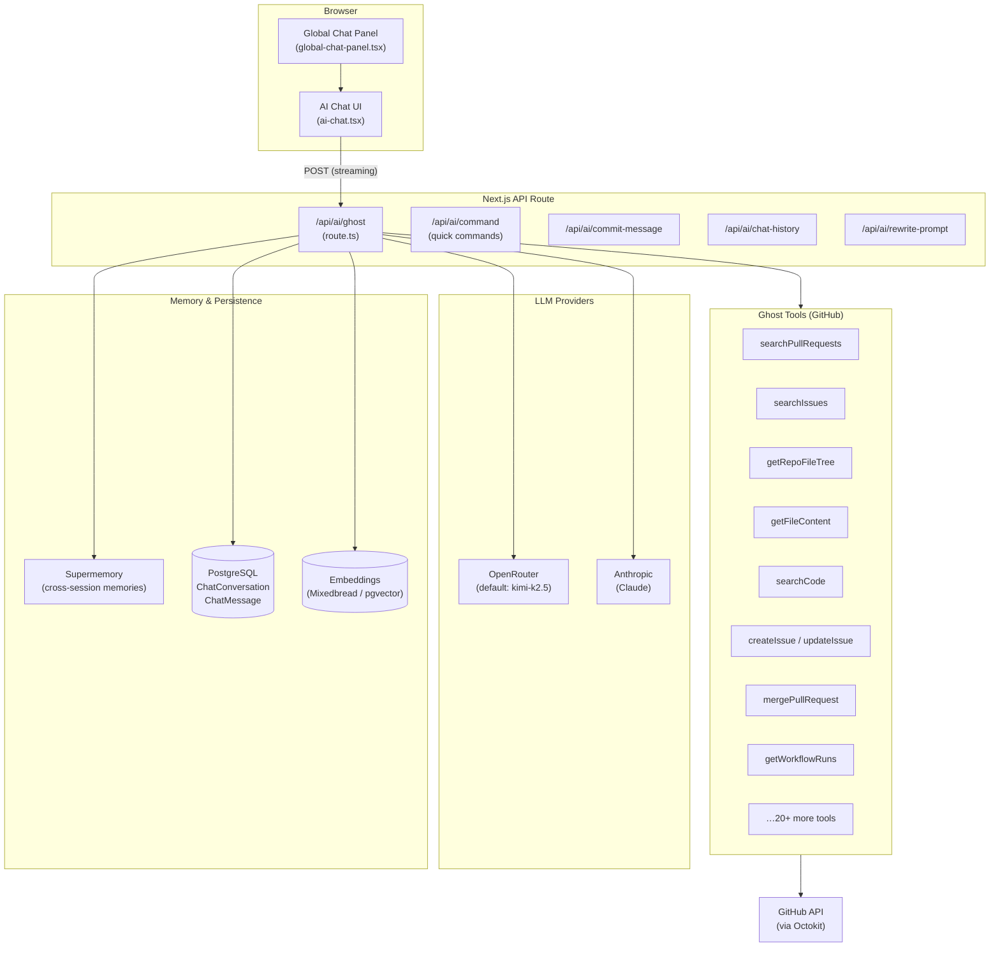
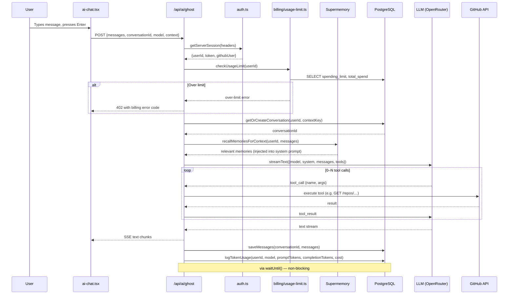
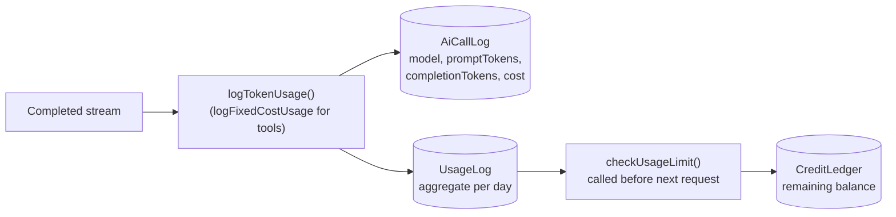

# Ghost AI Chat

Ghost is Better Hub's AI assistant, accessible via `⌘I` (or `Ctrl+I`). It streams responses, calls GitHub API tools, and can take actions on behalf of the user — creating issues, closing PRs, writing commit messages, and more.

---

## Architecture Overview



---

## Request Lifecycle



---

## Model Selection

Ghost supports multiple LLM providers and a smart **auto** mode:

```typescript
// src/app/api/ai/ghost/route.ts
const GHOST_MODELS = {
    default:       process.env.GHOST_MODEL        || "moonshotai/kimi-k2.5",
    mergeConflict: process.env.GHOST_MERGE_MODEL  || "google/gemini-2.5-pro-preview",
};

function resolveModel(userModel: string, task: GhostTaskType): string {
    if (userModel !== "auto") return userModel;
    return GHOST_MODELS[task] ?? GHOST_MODELS.default;
}
```

| User setting | Resolved model |
|---|---|
| `"auto"` (default) | `GHOST_MODEL` env var or `moonshotai/kimi-k2.5` |
| `"auto"` on merge-conflict task | `GHOST_MERGE_MODEL` or `google/gemini-2.5-pro-preview` |
| Any other string | Used verbatim (OpenRouter model ID) |

Users can override the model in **Settings → AI Model**, or supply their own OpenRouter API key.

---

## Available Tools

All tools are wrapped by `withSafeTools()` — a single tool failure (GitHub 403, rate limit, etc.) returns `{error: "…"}` to the LLM instead of crashing the stream.

### Read Tools

| Tool | Description |
|------|-------------|
| `searchPullRequests` | Full-text search PRs in a repository |
| `getPullRequest` | Get a single PR with diff and review comments |
| `searchIssues` | Search issues by keyword / label / state |
| `getIssue` | Get a single issue with all comments |
| `getRepoFileTree` | List directory contents |
| `getFileContent` | Read a single file |
| `searchCode` | Semantic search over indexed file content |
| `getWorkflowRuns` | List CI/CD workflow runs |
| `getCommit` | Inspect a specific commit |
| `getUserProfile` | GitHub user or org profile |
| `getRepoDetails` | Repository metadata, topics, license |
| `compareCommits` | Diff between two refs |
| `recallMemory` | Query Supermemory for past context |

### Write Tools

| Tool | Description |
|------|-------------|
| `createIssue` | Open a new issue |
| `updateIssue` | Edit title / body / state / labels |
| `createIssueComment` | Post a comment on an issue |
| `createPullRequestComment` | Post a review comment on a PR |
| `mergePullRequest` | Merge a PR (squash / merge / rebase) |
| `closePullRequest` | Close a PR without merging |
| `runE2BSandbox` | Execute code in a sandboxed E2B environment |
| `saveMemory` | Persist a fact to Supermemory for future sessions |

---

## Billing & Rate Limiting

Every completed AI call is logged for billing purposes:



- **`AiCallLog`** — one row per API call, raw token counts
- **`UsageLog`** — aggregated cost per user per day
- **`CreditLedger`** — credit balance with optional expiry (welcome credits, purchased credits)
- **`SpendingLimit`** — a configurable monthly hard cap (default: $10)

If a user exceeds their spending limit, the `/api/ai/ghost` route returns a structured billing error code and the UI shows an upgrade prompt.

---

## Conversation Persistence

Conversations are stored in two PostgreSQL tables:

```
ChatConversation
  id             — UUID
  userId         — owner
  chatType       — "ghost" | "pr" | "issue" | "repo" | …
  contextKey     — unique key tying conversation to a GitHub resource
                   e.g. "repo:owner/name" or "pr:owner/name/42"
  title          — auto-generated or user-edited
  activeStreamId — ID of any in-progress stream (for resumable streaming)

ChatMessage
  id             — UUID
  conversationId — FK → ChatConversation
  role           — "user" | "assistant" | "tool"
  content        — text content
  partsJson      — JSON array of message parts (for tool calls, images)
  createdAt      — timestamp
```

### Resumable Streaming

The `activeStreamId` field plus `streamContext` from `lib/resumable-stream.ts` allow a client to reconnect to an in-progress stream if the connection drops. The stream is replayed from the last confirmed chunk.

---

## Memory (Supermemory)

When `SUPER_MEMORY_API_KEY` is set, Ghost gains two additional tools:

- **`saveMemory`** — persists a user preference or fact across sessions
- **`recallMemory`** — hybrid-search for relevant past memories

Additionally, Ghost automatically recalls relevant memories **before** each LLM call by searching with the user's latest message as the query. Recalled memories are injected into the system prompt.

---

## Context Awareness

The `global-chat-panel.tsx` component detects the current route and injects page context into Ghost's initial system prompt:

| Current page | Ghost context |
|---|---|
| `/owner/repo` | Repo name, description, top language |
| `/owner/repo/pull/42` | PR title, number, diff summary |
| `/owner/repo/issues/7` | Issue title, labels, body |
| `/notifications` | "User is on the notifications page" |
| Anywhere | User's GitHub login, display name |

This context is sent as part of the system prompt, allowing Ghost to answer questions like "what's this PR about?" without the user having to specify the repo.

---

## Adding a New Tool

See [Adding New Tooling](./adding-tooling.md) for a complete walkthrough of adding a new Ghost tool.
