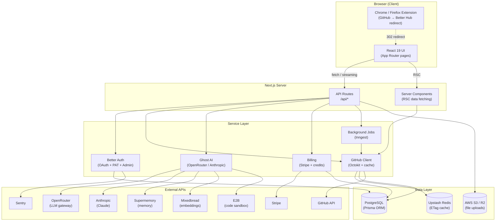

# Application Architecture

## Overview

Better Hub is a **monorepo** containing a Next.js web application and two browser extensions. The web application follows a full-stack Next.js pattern — React Server Components and App Router on the frontend, Node.js API Routes on the backend — backed by PostgreSQL, Redis, and external third-party APIs.



---

## Monorepo Structure

```
better-hub/
├── apps/
│   └── web/
│       ├── src/
│       │   ├── app/                # Next.js App Router (pages + API routes)
│       │   │   ├── (app)/          # Authenticated page group
│       │   │   │   ├── page.tsx    # Dashboard / home
│       │   │   │   ├── [owner]/[repo]/  # Repo pages
│       │   │   │   ├── notifications/
│       │   │   │   ├── issues/
│       │   │   │   ├── trending/
│       │   │   │   └── settings/
│       │   │   └── api/            # Backend API routes
│       │   │       ├── ai/         # Ghost, command, commit-message, …
│       │   │       ├── auth/       # Better Auth endpoints
│       │   │       ├── billing/    # Stripe webhooks, balance, limits
│       │   │       ├── search-*/   # Repo, issue, PR, code search
│       │   │       └── …
│       │   ├── components/         # 140+ React components
│       │   │   ├── shared/         # Global: AI chat, command palette, sidebar
│       │   │   ├── repo/           # Repo-specific components
│       │   │   ├── pr/             # PR review components
│       │   │   ├── issue/          # Issue management components
│       │   │   └── ui/             # Design system primitives (Radix UI)
│       │   ├── lib/                # Server-side services and utilities
│       │   │   ├── auth.ts         # Better Auth config
│       │   │   ├── github.ts       # Octokit wrapper + sync jobs
│       │   │   ├── chat-store.ts   # Chat persistence helpers
│       │   │   ├── billing/        # Stripe, credits, usage limits
│       │   │   └── …
│       │   ├── hooks/              # Client-side React hooks
│       │   └── generated/          # Prisma generated client
│       └── prisma/
│           ├── schema.prisma       # Database schema (20+ models)
│           └── migrations/         # Prisma migration history
├── packages/
│   ├── chrome-extension/           # Manifest v3 extension
│   └── firefox-extension/          # Firefox extension
└── docs/                           # This directory
```

---

## Key Subsystems

### Authentication (`src/lib/auth.ts`)

Better Auth is configured with:
- **GitHub OAuth** — primary login flow
- **Personal Access Token (PAT)** — alternative login / API access
- **Admin plugin** — session impersonation for support
- **Stripe plugin** — automatic customer creation on signup

### GitHub Integration (`src/lib/github.ts`)

A thin wrapper around `@octokit/rest` that:
1. Resolves the authenticated user's token from the session
2. Checks the local cache (Redis/PostgreSQL) before hitting the GitHub API
3. Uses HTTP ETags so unchanged resources are not re-fetched
4. Enqueues background sync jobs (via `GithubSyncJob` table + Inngest) for expensive or periodic refreshes

### Ghost AI (`src/app/api/ai/ghost/route.ts`)

Streaming API route that:
1. Validates the session and spending cap
2. Selects an LLM (OpenRouter or Anthropic) based on user preference / task type
3. Provides a set of **tools** (PR search, file browsing, code search, …) to the model
4. Streams the response via Server-Sent Events (Vercel AI SDK)
5. Logs token usage for billing

See [AI Chat](./ai-chat.md) for full details.

### Billing (`src/lib/billing/`)

- **Stripe subscriptions** for base plans
- **Credit ledger** for pay-as-you-go AI usage
- **Spending limits** — hard caps enforced before every AI call
- **Token usage logging** — every LLM call records model, prompt tokens, completion tokens, and cost

### Browser Extensions (`packages/*/`)

Manifest v3 extensions that use the Declarative Net Request API to intercept navigation to `github.com` and redirect to the configured Better Hub host. Users can toggle redirection on/off via the popup.

---

## Deployment

The application is deployed on **Vercel** (Next.js native deployment). Infrastructure dependencies:

| Service | Purpose |
|---------|---------|
| PostgreSQL 16 | Primary database (Neon or self-hosted) |
| Upstash Redis | ETag cache and sync-job deduplication |
| AWS S3 / Cloudflare R2 | User file uploads |
| Vercel Functions | API routes (edge/serverless) |
| Inngest Cloud | Durable background job execution |
| Sentry | Error tracking and performance monitoring |
| Vercel Analytics | Web vitals and traffic analytics |
