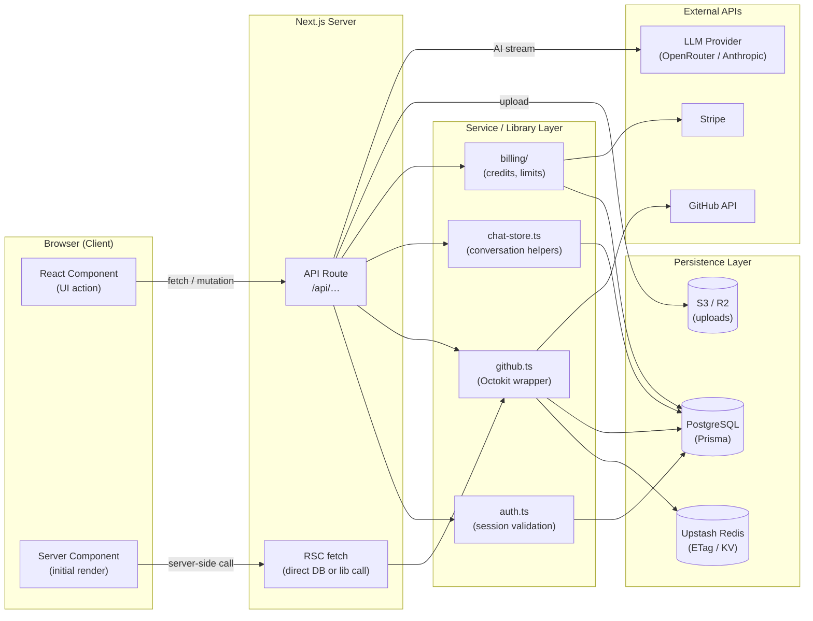
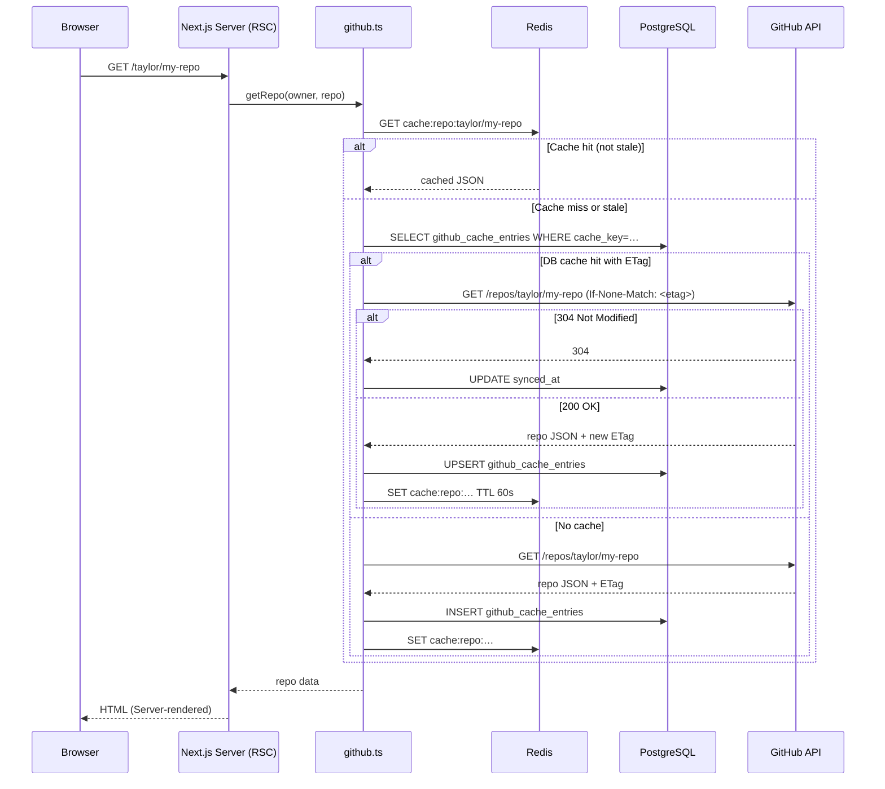
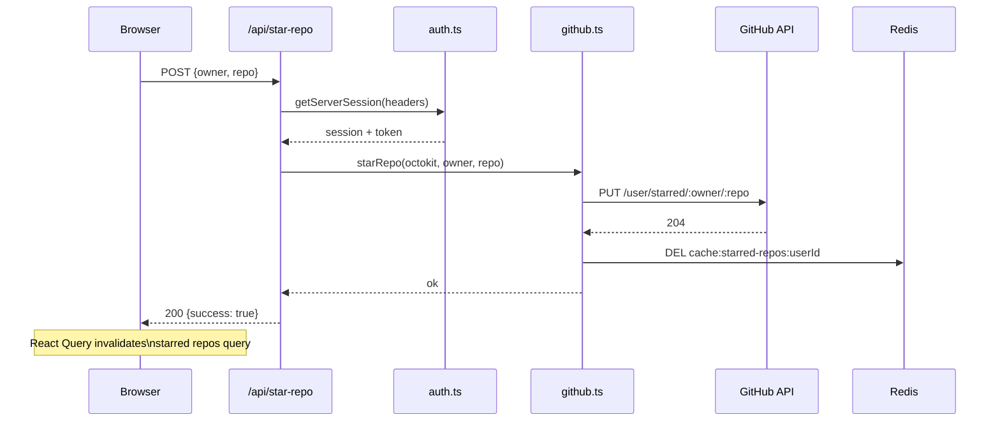
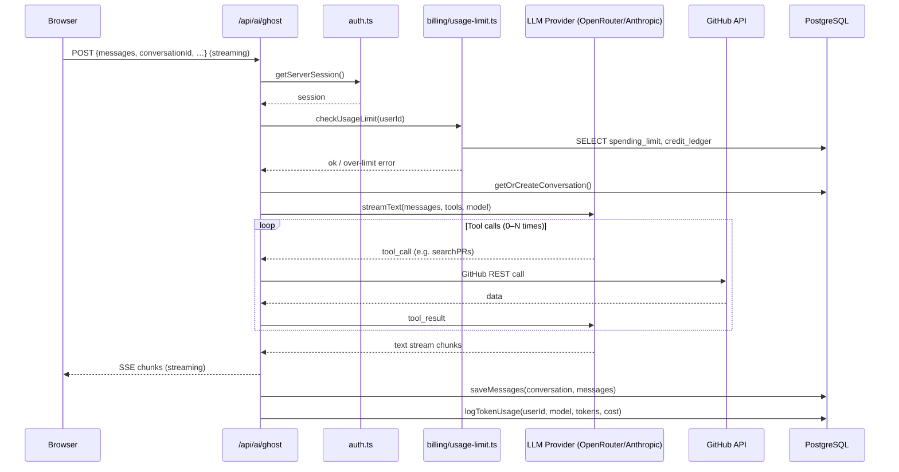
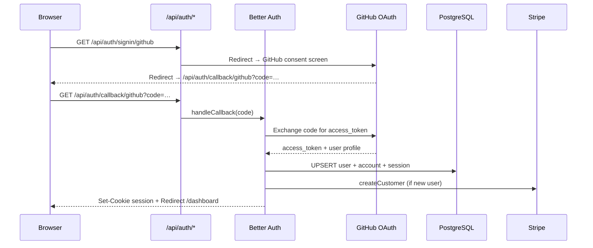
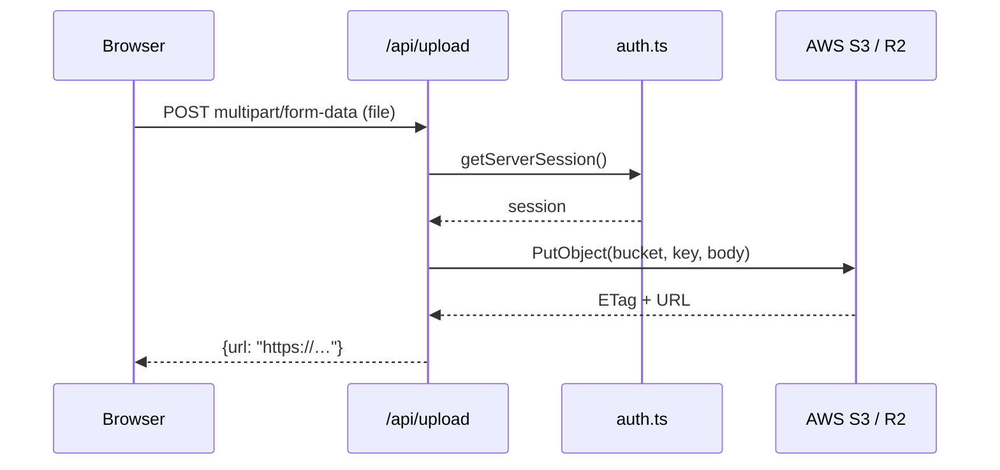
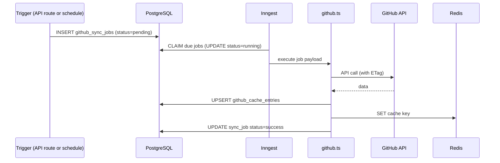

# Data Flow & Integration Layers

This document traces every significant data path in Better Hub — from a user action in the browser through the server API to storage (and back).

---

## Layer Overview

---

## 1. Page Load (Server Components)

---

## 2. Client-Side Data Mutation (e.g. Star a Repo)

---

## 3. AI Chat (Ghost) — Full Flow

See [AI Chat](./ai-chat.md) for deeper detail. Summary:

---

## 4. Authentication Flow

---

## 5. File Upload

---

## 6. Background Sync (Inngest Jobs)

---

## Integration Layer Summary

| Layer | Technology | Responsibility |
|-------|-----------|----------------|
| **Client** | React 19 / TanStack Query | UI rendering, optimistic updates, streaming |
| **Server** | Next.js API Routes / RSC | Request handling, auth checks, orchestration |
| **Service** | `lib/*.ts` modules | Business logic, caching, external API calls |
| **Persistence** | PostgreSQL (Prisma) | Authoritative data store |
| **Cache** | Upstash Redis | Fast ETag cache, deduplication keys |
| **CDN/Storage** | S3 / R2 | Binary file storage |
| **GitHub API** | Octokit | Source of truth for GitHub data |
| **LLM** | OpenRouter / Anthropic | AI inference |
| **Jobs** | Inngest | Durable async work |
| **Payments** | Stripe | Subscriptions and billing events |
