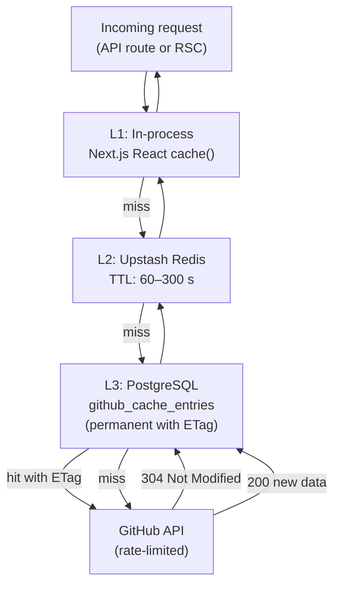
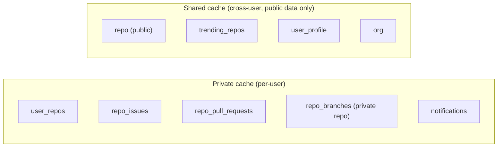
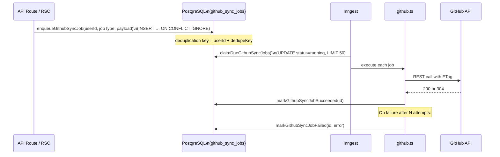
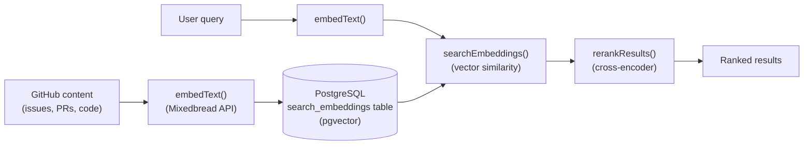

# Data Ingestion

This document describes how Better Hub synchronises GitHub data into its own storage layer — the caching strategy, ETag handling, sync job queue, and security boundaries.

---

## Why We Cache GitHub Data

GitHub's REST API has a **5,000 req/hour** rate limit per authenticated token. Without caching:
- A single repo page with README, file tree, branches, PRs, and issues would exhaust ~10–20 requests.
- Background refreshes for notifications and trending would continually drain the quota.

The caching layer reduces API calls by:
1. **HTTP ETag validation** — ask GitHub "has this changed?" instead of re-fetching.
2. **In-process Redis TTL** — serve hot data without touching PostgreSQL or GitHub.
3. **Deduplication** — prevent multiple concurrent jobs from racing to fetch the same resource.

---

## Storage Tiers



### L1 — React `cache()`

The `cache()` wrapper from React deduplicates calls within a **single request lifecycle** (one RSC render tree). Multiple components that call `getRepo(owner, repo)` on the same page will only hit L2/L3 once.

### L2 — Upstash Redis

Short-lived TTL cache (60–300 seconds depending on resource type). Stored as a JSON string under a deterministic key such as `cache:repo:owner/repo:userId`. Avoids hitting PostgreSQL on every request.

### L3 — PostgreSQL (`github_cache_entries`)

Persistent ETag store. Each row holds:

```
userId     — owner of the cache entry (or "shared" for public data)
cacheKey   — unique resource key
cacheType  — job type (e.g. "repo", "repo_branches")
dataJson   — full API response as JSON string
etag       — GitHub ETag header value
syncedAt   — ISO timestamp of last successful sync
```

On cache miss the GitHub API is called. If the response includes an `ETag` header, it is stored. On subsequent requests, `If-None-Match: <etag>` is sent; a `304 Not Modified` response only updates `syncedAt`, avoiding a write of potentially large JSON blobs.

---

## Security: Shared vs. Private Cache



> **Security rule**: Any resource that could contain data from a private repository is **always** stored in the per-user cache. It is never written to or read from the shared cache. This prevents a user with access to a private repo from inadvertently exposing its data to another user.

The constant `SHARED_CACHE_TYPES` in `github.ts` lists the only job types eligible for shared caching.

---

## Sync Job Queue

For resources that are expensive or should be refreshed in the background, Better Hub uses a **sync job queue** stored in PostgreSQL.



### Job Types

| Category | Job Types |
|----------|-----------|
| **User** | `user_repos`, `authenticated_user`, `user_orgs`, `notifications`, `starred_repos`, `contributions`, `user_events` |
| **Repo** | `repo`, `repo_contents`, `repo_tree`, `repo_branches`, `repo_tags`, `repo_releases`, `repo_readme`, `repo_nav_counts` |
| **PR** | `pull_request`, `pull_request_files`, `pull_request_comments`, `pull_request_reviews`, `pull_request_commits`, `pr_bundle` |
| **Issue** | `issue`, `issue_comments`, `repo_issues` |
| **Search** | `search_issues`, `trending_repos` |
| **CI/CD** | `repo_workflows`, `repo_workflow_runs` |
| **People** | `user_profile`, `user_public_repos`, `user_public_orgs`, `org_members`, `repo_contributors`, `person_repo_activity` |

### Deduplication

`enqueueGithubSyncJob` uses a `(userId, dedupeKey)` unique constraint. If a job with the same dedupe key already exists in a non-terminal state, the insert is silently ignored. This prevents queue flooding when multiple UI components request the same data.

### Retry Strategy

Failed jobs increment an `attempts` counter and set `nextAttemptAt` to a back-off time. Jobs are re-claimed by Inngest on the next poll cycle up to a configurable maximum attempt count.

---

## Cache Invalidation

Certain write operations must invalidate cache entries to prevent stale reads. Helper functions in `github.ts` handle this:

| Operation | Cache invalidated |
|-----------|-------------------|
| Close / merge a PR | `invalidatePullRequestCache`, `invalidateRepoPullRequestsCache` |
| Close / reopen an issue | `invalidateIssueCache`, `invalidateRepoIssuesCache` |
| Push a commit | `deleteGithubCacheByPrefix(userId, "repo_tree:…")` |
| Force-refresh | `deleteGithubCacheByPrefix` / `deleteSharedCacheByPrefix` |

These are called inside the Ghost AI tool handlers (e.g. after the AI closes an issue) as well as inside mutation API routes.

---

## Semantic Search (Embeddings)

Beyond the standard GitHub cache, Better Hub indexes repository content for **semantic search** using Mixedbread AI embeddings:



The `SearchEmbedding` Prisma model stores:
- `userId`, `contentType`, `contentId` — identity
- `content` — original text
- `embedding` — float vector (pgvector)

Ghost uses `searchEmbeddings()` as a tool to find semantically relevant issues, PRs, or code snippets without keyword matching.
