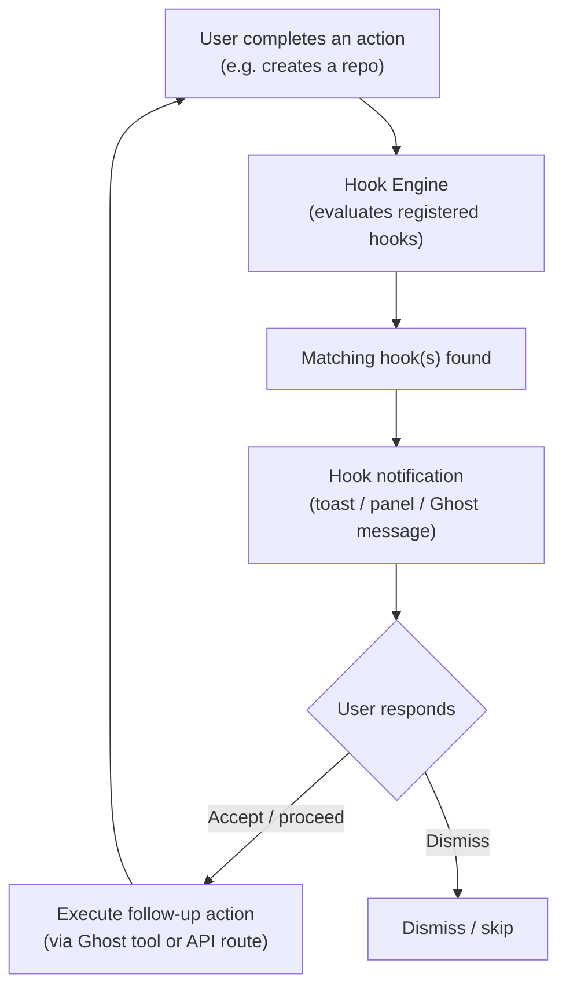
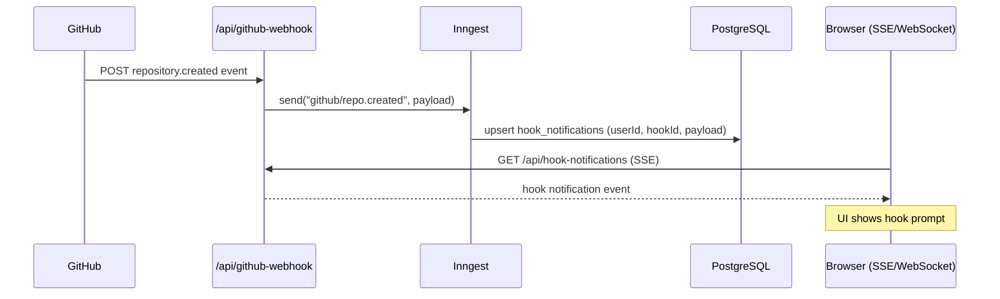
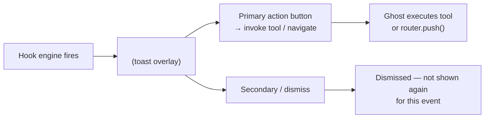
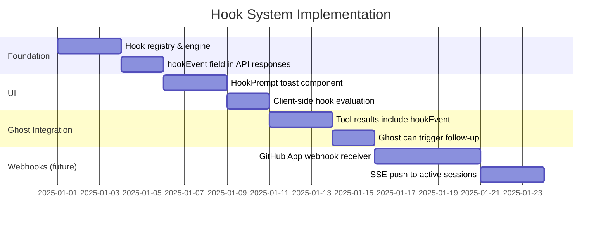

# Hooks & Action Chaining

This document describes a plan for connecting GitHub actions together so that completing one action automatically suggests or triggers the next relevant action — without the user having to navigate away or remember what to do next.

A concrete example: **after a repository is created, prompt the user to add teams to it**.

---

## Motivation

Many GitHub workflows consist of multiple sequential steps that users frequently forget or have to look up:

| Trigger action | Natural follow-up |
|---|---|
| Create a repository | Add teams → set branch protection → create initial issue |
| Merge a pull request | Delete branch → deploy → notify stakeholders |
| Close an issue | Check linked PRs → update project board |
| Add a collaborator | Set their team → assign them an issue |
| Create a release | Announce in Discussions → update docs |

Currently these steps are disconnected. A hook system surfaces them as **in-context prompts** without forcing users into a rigid workflow.

---

## High-Level Architecture



---

## Hook Registry Design

Hooks are registered as plain configuration objects. Each hook declares:

- **`trigger`** — the action type that activates it
- **`condition`** — optional predicate that must be true (e.g. repo is in an org)
- **`prompt`** — the message shown to the user
- **`actions`** — one or more follow-up actions the user can take

```typescript
// apps/web/src/lib/hooks/registry.ts

export interface ActionHook {
    /** Unique identifier */
    id: string;
    /** The action type that fires this hook */
    trigger: ActionType;
    /** Optional: only fire when this returns true */
    condition?: (context: HookContext) => boolean;
    /** Message shown to the user */
    prompt: string;
    /** Suggested follow-up actions */
    actions: HookAction[];
}

export type ActionType =
    | "repo.created"
    | "repo.forked"
    | "pr.merged"
    | "pr.closed"
    | "issue.closed"
    | "release.created"
    | "collaborator.added"
    | "branch.deleted"
    ;

export interface HookContext {
    userId: string;
    owner:  string;
    repo?:  string;
    number?: number;        // PR or issue number
    data:   Record<string, unknown>;  // raw payload from the trigger action
}

export interface HookAction {
    label:   string;
    /** Ghost tool name to invoke, or a custom handler */
    tool?:   string;
    /** Arguments pre-filled from context */
    args?:   (ctx: HookContext) => Record<string, unknown>;
    /** Alternatively, navigate to a URL */
    href?:   (ctx: HookContext) => string;
}

// ─── Built-in hooks ────────────────────────────────────────────────────────

export const BUILT_IN_HOOKS: ActionHook[] = [
    {
        id: "repo-created-add-teams",
        trigger: "repo.created",
        condition: (ctx) => !!ctx.data.organization,  // org repos only
        prompt: "Repository created! Would you like to add teams to control access?",
        actions: [
            {
                label: "Add teams",
                tool:  "addTeamToRepo",
                args:  (ctx) => ({ owner: ctx.owner, repo: ctx.data.name }),
            },
            {
                label: "Set branch protection",
                href:  (ctx) =>
                    `/${ctx.owner}/${ctx.data.name}/settings/branches`,
            },
        ],
    },

    {
        id: "pr-merged-delete-branch",
        trigger: "pr.merged",
        prompt: "PR merged. Delete the head branch?",
        actions: [
            {
                label: "Delete branch",
                tool:  "deleteBranch",
                args:  (ctx) => ({
                    owner:  ctx.owner,
                    repo:   ctx.repo,
                    branch: (ctx.data as { head: { ref: string } }).head.ref,
                }),
            },
        ],
    },

    {
        id: "release-created-announce",
        trigger: "release.created",
        prompt: "Release published! Announce it in Discussions?",
        actions: [
            {
                label: "Create announcement",
                tool:  "createDiscussion",
                args:  (ctx) => ({
                    owner:   ctx.owner,
                    repo:    ctx.repo,
                    title:   `Released: ${(ctx.data as { tag_name: string }).tag_name}`,
                    body:    (ctx.data as { body: string }).body,
                    category: "Announcements",
                }),
            },
        ],
    },
];
```

---

## Hook Engine

The engine evaluates hooks against a fired action and returns matching notifications:

```typescript
// apps/web/src/lib/hooks/engine.ts

import { BUILT_IN_HOOKS, type ActionType, type HookContext, type ActionHook } from "./registry";

export function evaluateHooks(
    trigger: ActionType,
    context: HookContext,
    extraHooks: ActionHook[] = [],
): ActionHook[] {
    return [...BUILT_IN_HOOKS, ...extraHooks].filter(
        (hook) =>
            hook.trigger === trigger &&
            (hook.condition == null || hook.condition(context)),
    );
}
```

---

## Integration Points

### 1. After an API Route Mutation

When an API route (e.g. `POST /api/create-repo`) completes successfully, it emits a hook event to the client:

```typescript
// apps/web/src/app/api/create-repo/route.ts (simplified)

export async function POST(request: NextRequest) {
    // … create repo via Octokit …

    return NextResponse.json({
        repo,
        // Signal to the client that hooks should fire
        hookEvent: {
            trigger: "repo.created",
            owner:   session.githubUser.login,
            data:    repo,
        },
    });
}
```

The client reads `hookEvent` from the response and calls the hook engine:

```typescript
// Client-side React Query mutation onSuccess:

onSuccess(response) {
    const hooks = evaluateHooks(
        response.hookEvent.trigger,
        { userId, owner: response.hookEvent.owner, data: response.hookEvent.data },
    );
    if (hooks.length > 0) {
        openHookPanel(hooks[0]); // show the first (highest-priority) hook
    }
},
```

### 2. After a Ghost Tool Call

Ghost write tools (e.g. `mergePullRequest`, `createIssue`) already return results to the AI stream. The result can include a `hookEvent` field that the UI picks up:

```typescript
// In ghost/route.ts tool definition:

mergePullRequest: tool({
    // …
    execute: async ({ owner, repo, pull_number, merge_method }) => {
        const result = await octokit.pulls.merge({ owner, repo, pull_number, merge_method });
        return {
            merged: result.data.merged,
            sha:    result.data.sha,
            // Hook payload surfaced to the client via streaming metadata
            hookEvent: {
                trigger: "pr.merged",
                owner, repo,
                data: { head: { ref: prDetails.head.ref } },
            },
        };
    },
}),
```

### 3. GitHub Webhooks (Future)

For events originating outside Better Hub (e.g. a team member creates a repo via the GitHub web UI), register a GitHub App webhook:



---

## UI Component: Hook Prompt

The hook prompt appears as a non-blocking **toast** with action buttons. It uses the existing toast/notification system:



**Component sketch:**

```tsx
// apps/web/src/components/shared/hook-prompt.tsx

interface HookPromptProps {
    hook: ActionHook;
    context: HookContext;
    onDismiss: () => void;
}

export function HookPrompt({ hook, context, onDismiss }: HookPromptProps) {
    return (
        <div className="hook-prompt-toast">
            <p>{hook.prompt}</p>
            <div className="actions">
                {hook.actions.map((action) => (
                    <button
                        key={action.label}
                        onClick={() => {
                            if (action.tool) {
                                invokeGhostTool(action.tool, action.args?.(context));
                            } else if (action.href) {
                                router.push(action.href(context));
                            }
                            onDismiss();
                        }}
                    >
                        {action.label}
                    </button>
                ))}
                <button onClick={onDismiss}>Dismiss</button>
            </div>
        </div>
    );
}
```

---

## Example: Repo Created → Add Teams Flow

```mermaid
sequenceDiagram
    participant User
    participant UI as Better Hub UI
    participant API as /api/create-repo
    participant GitHub as GitHub API
    participant HookEngine as Hook Engine
    participant Ghost as Ghost (AI)

    User->>UI: Fill "New Repository" form, click Create
    UI->>API: POST {name, visibility, org}
    API->>GitHub: POST /orgs/{org}/repos
    GitHub-->>API: 201 repo JSON
    API-->>UI: {repo, hookEvent: {trigger: "repo.created", …}}

    UI->>HookEngine: evaluateHooks("repo.created", context)
    HookEngine-->>UI: [repo-created-add-teams hook]
    UI->>User: 🔔 Toast: "Repository created! Would you like to add teams?"
                [Add teams] [Set branch protection] [Dismiss]

    User->>UI: Clicks "Add teams"
    UI->>Ghost: invoke tool addTeamToRepo({owner, repo: "my-repo"})
    Ghost->>GitHub: PUT /orgs/{org}/teams/{team_slug}/repos/{owner}/{repo}
    GitHub-->>Ghost: 204
    Ghost-->>UI: "Done — team 'backend' now has push access to my-repo."
```

---

## Implementation Roadmap



### Phase 1 — Foundation

- [ ] Create `apps/web/src/lib/hooks/registry.ts` with `ActionHook` types and built-in hooks
- [ ] Create `apps/web/src/lib/hooks/engine.ts` with `evaluateHooks()`
- [ ] Add `hookEvent` field to JSON responses from write API routes

### Phase 2 — UI

- [ ] Create `HookPrompt` toast component
- [ ] Wire `evaluateHooks()` into React Query `onSuccess` callbacks
- [ ] Persist dismissed hooks in `localStorage` to avoid re-showing

### Phase 3 — Ghost Integration

- [ ] Return `hookEvent` from Ghost write tools
- [ ] Parse `hookEvent` from streamed tool results in `ai-chat.tsx`
- [ ] Ghost can optionally auto-execute the follow-up (if user accepts)

### Phase 4 — Webhooks (future)

- [ ] Register a GitHub App with `repository`, `pull_request`, and `issues` webhook events
- [ ] Create `/api/github-webhook` handler that validates signatures and fires Inngest events
- [ ] Push hook notifications to active browser sessions via SSE or WebSocket
